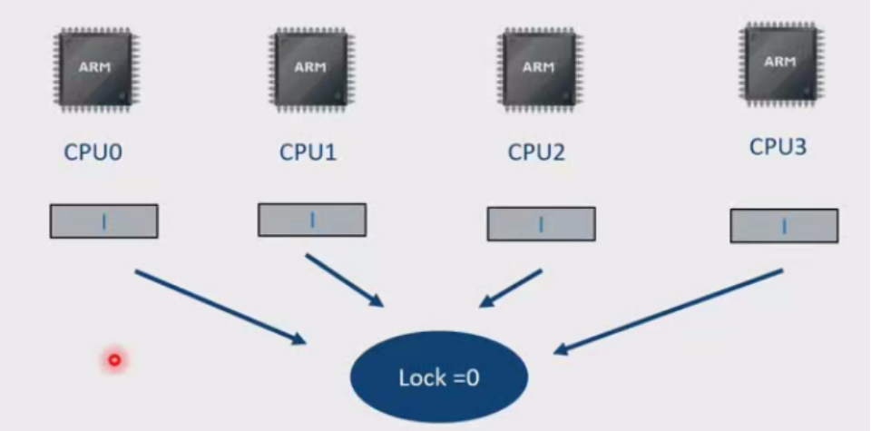
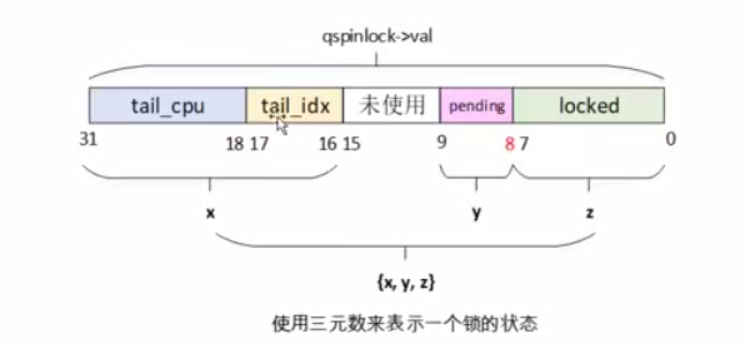
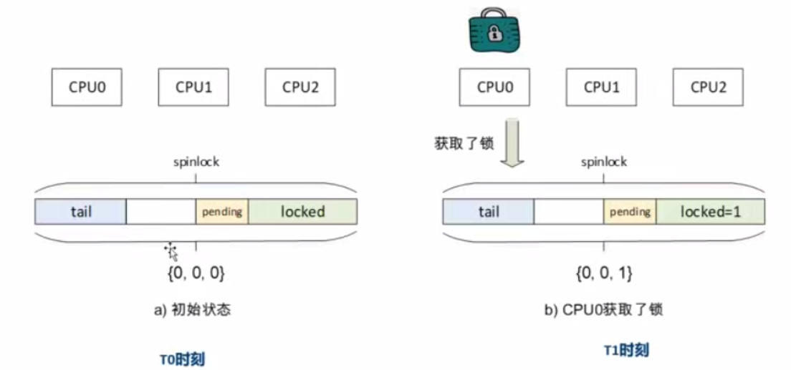
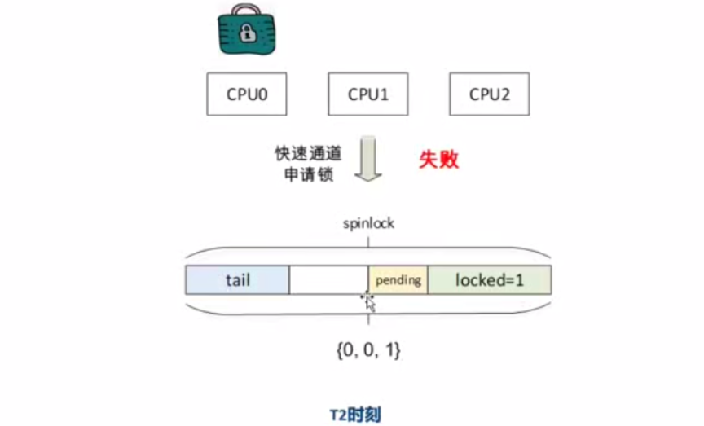
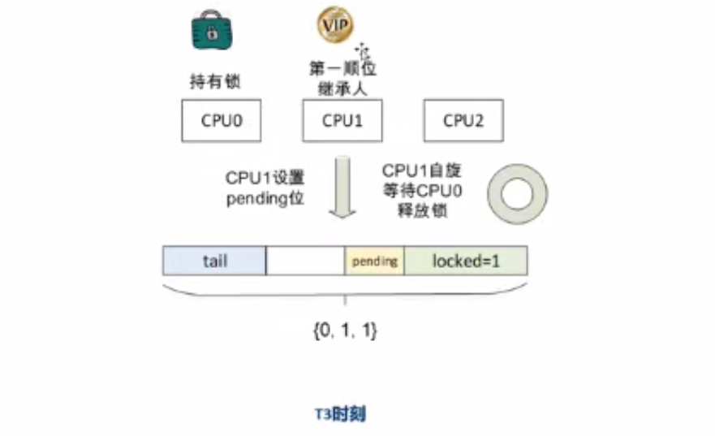

<!--
 * @Date: 2025-03-25
 * @LastEditors: GoKo-Son626
 * @LastEditTime: 2025-04-04
 * @FilePath: /qspinlock/MCS.md
 * @Description: 
--> 
## spinlock

原子变量是基于硬件实现的，但是保护的范围有限，CAS指令最大支持64bit（8字节大小），但是实际链表等集合很大，对其操作是一个过程，不适合，自旋锁会让内核代码路径（进程或中断处理程序）自旋等待，锁可以分为两种：**忙等待和睡眠等待**，自旋锁的临界区中的代码要尽快执行完成，不能调度或者睡眠，自旋锁可以在（软，硬件，不可屏蔽）中断上下文或进程上下文使用，即CPU在自旋锁的临界区里面只能老老实实地执行。
```c
static inline void __raw_spin_lock(raw_spinlock_t *lock){
         preempt_disable();
 }
__raw_spin_lock_irq(raw_spinlock_t *lock){local_irq_disable();//关闭local的中断防止中断导致死锁
}
__raw_spin_lock_irqsave(raw_spinlock_t *lock){//关闭本地所有中断并保存当前中断的状态p_status
}
__raw_spin_lock_bh(raw_spinlock_t *lock)//禁用本地软中断，工作仍被安排，但直到重新启用软中断时才会执行
```

为什么要有spinlock和row_spinlock函数，为什么spinlock调用row_spinlock函数，
实时补丁（允许在自旋锁的临界区里面去睡眠）有一小部分绝对不能中断和睡眠的地方使用row_spinlock，
允许睡眠就使用spinlock
未打补丁的就是直接调用row_spinlock,打补丁就 能睡眠时使用spinlock

**经典自旋锁：**

- 有顺序问题，公平性（cache）

---

**Ticket spinlock：** 解决公平问题，还有性能问题

- spinlock: **next | owner**

---

**MCS算法：**

-

---

**qspinlock：** 

- 

-----------------------------------------------------

**经典spinlock：** 

假设CPU0....同时抢占一个经典的spinlock锁，分析catch line的情况



**MESI协议：：：**
- T0：l都为无效
- T1：cpu0尝试获取：读取本地，因为为I，向总线发送BusRead信号,广播到其它cpu中，其它cpu自查local catchline有没有缓存变量，图中肯定没有，于是从内存读取lock值加载到自己的catcheline，I-> E,读取到为0,所以尝试stxr写1到lock，E-> M，成功
- T2：cpu1尝试获取：本地读-> Busread-> CPU0为M收到就会把自己的catchline发送到内存总线上，E-> S-> CPU1 I-> S获取到CPU0的值，为S做不了什么，
- T3：cpu2和cpu3尝试获取：也会从I-> S
- T4：CPU0释放锁：（stlr将lock-> 0，因为为S，所以应该是本地但是变成了总线的）将自己改为M，然后发送busupg信号，其它三个便将各自的S-> I，lock-> 0
- **T5：** CPU123都尝试获取锁：假设CPU1先读
- ldxr读catcheline发现无效，BUSread后cpu0发现自己为M，cpu0把数据发送到总线上，把自己的状态改为S，CPU1得到状态值改为S，但是读到lock值发现为0,cpu1变为独占状态
- T6：CPU2也尝试获取：CPU2也变I-> S，CPU2本地监视器的状态也会变成独占，
- T7：CPU1写1到lock，S-> M，发送upgrd到总线，其它cpu检查并更改本地cacheline，CPU02的S-I，CPU12独占变为开放，CPU1写1到lock，获取了锁
- T8：CPU2也想获取锁写1到lock，但是为开放状态不行，stxr写入失败，loop重新加载lock
- T9：CPU2重新加载lock，发送busread，然后CPU1回应，CPU2I-> S，CPU1也M-> S，但是CPU2发现lock=1,只能继续自旋
- **总结** CPU核心越大，cache颠簸越厉害，影响传输量变大，降低性能

--- 

**MCS锁**

> 本质上是一种基于链表结构的自旋锁
> 每个锁申请的过程中它在自己的本地的CPU变量上去自旋，而不是像经典的spinlock实现一样在全局的变量中自旋

1. MCS锁基于链表结构的自旋锁，锁本身是一个 atomic_mcs_node_t *lock 指针，指向MCS链表的末尾。
2. 每个CPU有一个对应的节点，节点包含lock成员，CPU在节点上自选等待锁。
3. 当CPU持有锁时，其他CPU来申请锁时会依次排队，把自己的节点链接到当前CPU节点后面。
4. 解锁时，当前CPU会把自己的节点从链表中摘除，并把锁传递给下一个节点。

- 每个 CPU 线程创建的 node 结构都是一样的，但它们是独立的，每个线程都有自己的 node 实例。
typedef struct mcs_node {
     struct mcs_node *next;  // 指向下一个等待的线程
    bool locked;            // 是否持有锁
} mcs_node_t;


- 


**普通自旋锁（Ticket Lock 或者 Spin Lock）**

竞争线程会在一个共享变量（如 lock）上持续自旋，不断尝试获取锁。
多个 CPU 竞争同一个变量，导致大量的 缓存一致性协议（比如 MESI）通讯，导致总线流量增加。
CPU 资源被无意义地消耗，影响其他线程运行。

**MCS 自旋锁**

MCS 仍然是自旋锁，但每个线程只在自己的 mcs_node_t 变量上自旋，而不是共享变量 lock 上。
这样避免了 多个 CPU 访问同一个锁变量导致的缓存一致性流量，即 避免了 CPU 间的“锁争夺”导致的总线流量问题。
但是线程仍然在 CPU 上忙等，不会主动让出 CPU，因此 如果线程调度时间过长，仍然会造成 CPU 资源浪费。
- MCS 的特点是：它优化了自旋锁的缓存一致性问题，但并不等于它是“阻塞锁”。


## qspinlock
**include/asm-generic/qspinlock_types.h:**锁数据结构
```c
typedef struct qspinlock {
        union {
                atomic_t val;

                /*
                 * By using the whole 2nd least significant byte for the
                 * pending bit, we can allow better optimization of the lock
                 * acquisition for the pending bit holder.
                 */
#ifdef __LITTLE_ENDIAN
                struct {
                        u8      locked;
                        u8      pending;
                };
                struct {
                        u16     locked_pending;
                        u16     tail;
                };
#else
                struct {
                        u16     tail;
                        u16     locked_pending;
                };
                struct {
                        u8      reserved[2];
                        u8      pending;
                        u8      locked;
                };
#endif
        };
} arch_spinlock_t;

/*
 * Initializier
 */
#define __ARCH_SPIN_LOCK_UNLOCKED       { { .val = ATOMIC_INIT(0) } }

/*
 * Bitfields in the atomic value:
 *
 * When NR_CPUS < 16K
 *  0- 7: locked byte
 *     8: pending
 *  9-15: not used
 * 16-17: tail index
 * 18-31: tail cpu (+1)
 *
 * When NR_CPUS > = 16K
 *  0- 7: locked byte
 *     8: pending
 *  9-10: tail index
 * 11-31: tail cpu (+1)
 */
#define _Q_SET_MASK(type)       (((1U << _Q_ ## type ## _BITS) - 1)\
                                      << _Q_ ## type ## _OFFSET)
#define _Q_LOCKED_OFFSET        0
#define _Q_LOCKED_BITS          8
#define _Q_LOCKED_MASK          _Q_SET_MASK(LOCKED)
```



**kernel/locking/mcs_spinlock.h**
```c
struct mcs_spinlock {
        struct mcs_spinlock *next;
        int locked; /* 1 if lock acquired */
        int count;  /* nesting count, see qspinlock.c */
};
```
`locked = 1`:只是说锁传到了当前加节点，但是当前节点还需要主动申请锁(qspinlock-> locked = 1)
`count`：四种上下文

**kernel/locking/qspinlock.c:**
```c
#define MAX_NODES       4

struct qnode {
        struct mcs_spinlock mcs;
#ifdef CONFIG_PARAVIRT_SPINLOCKS
        long reserved[2];
#endif
};

/*
 * Per-CPU queue node structures; we can never have more than 4 nested
 * contexts: task, softirq, hardirq, nmi.
 *
 * Exactly fits one 64-byte cacheline on a 64-bit architecture.
 *
 * PV doubles the storage and uses the second cacheline for PV state.
 */
static DEFINE_PER_CPU_ALIGNED(struct qnode, qnodes[MAX_NODES]);
```
**申请锁：**
**include/asm-generic/qspinlock.h**
:try_cmpxchg
:slowpatch-> kerner/locking/qspinlock.c
val & ~Q_LOCKED_MASK:tail(true) ->  goto queue
否则，queue中为空，当前cpu直接为队列头->  locked = 1,返回lockval旧值
检查中间是否有其它cpu进入

0,1,1(自旋等待锁) ->  0,0,1(得到锁)：退出循环

| 申请         | 操作                                                                                                                                                |
| ------------ | --------------------------------------------------------------------------------------------------------------------------------------------------- |
| 快速申请通道 | 这个锁当前没有人持有，直接通过cmpxchg()设置locked域即可获取了锁。                                                                                   |
| 中速申请通道 | 锁已经被人持有，但是MCS链表没有其他人，有且仅有一个人在等待这个锁。设置pending域，表示是第一顺位继承者，自旋等待lock-> locked清0，即锁持有者释放锁。 |


- val == _Q_PENDING_VAL:0,1,0 ->  锁处于临界状态，锁的持有者正在释放锁


qspinlock的研究（尽量贴近risc-v，从使用者和开发者的角度进行深入研究）


